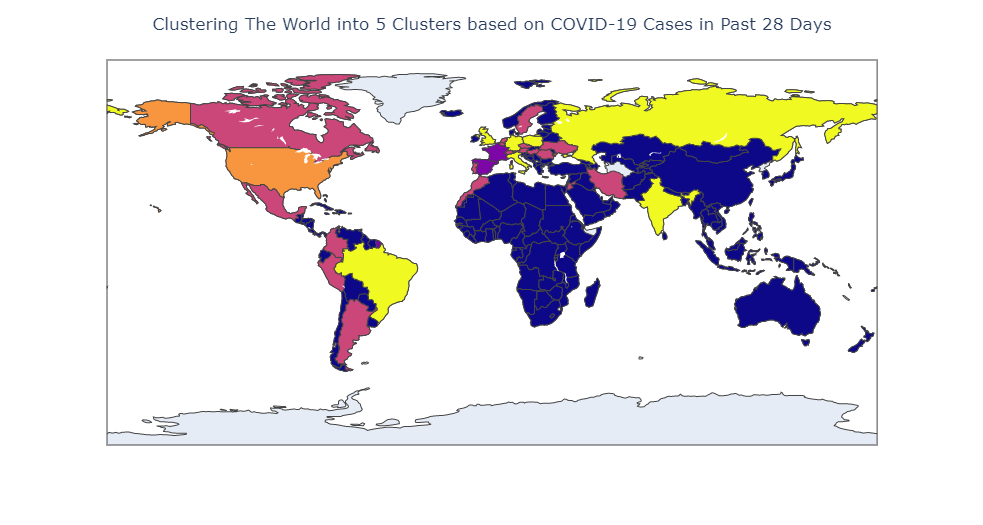
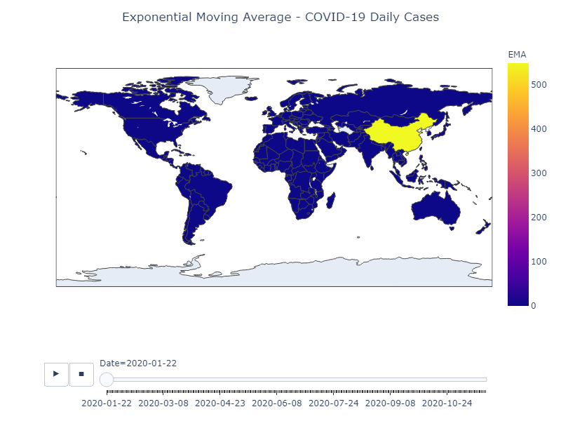

# covid19

1. Cluster 191 countries based on COVID-19 cases.  
https://github.com/rickysoo/covid19/blob/main/countries.ipynb

2. Visualize COVID-19 cases using moving averages.  
https://github.com/rickysoo/covid19/blob/main/averages.ipynb

